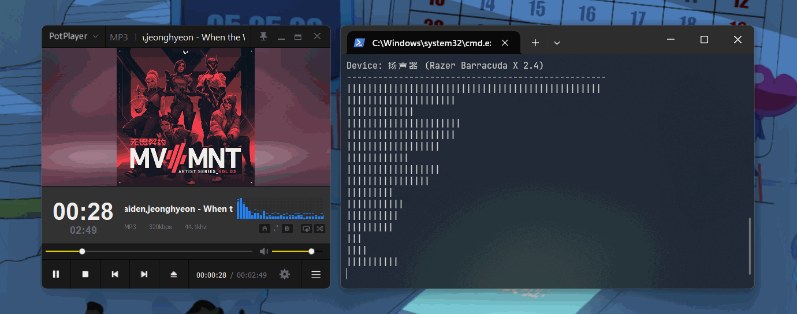

# Node-Windows-Audio-Visualisation

<a href="https://github.com/LeagueTavern/node-window-audio-visualisation/issues"></a>
<a href="https://github.com/LeagueTavern/node-window-audio-visualisation/actions"></a>
<a href="https://nodejs.org/en/about/releases/"></a>
<a href="https://www.npmjs.com/package/@coooookies/window-audio-visualisation"></a>
<a href="https://npmcharts.com/compare/@coooookies/window-audio-visualisation?minimal=true"></a>



> This library allows developers to access audio visualisation data from the Windows using [Node.js](https://nodejs.org/), providing a simple API to access this data. It is written in [Rust](https://www.rust-lang.org/) and utilizes [napi-rs](https://napi.rs/) to implement bindings with Node.js.

## ⚠️ Warning

`node-window-audio-visualisation` only supports Windows.

## 🚀 Features

- Access to the Windows audio visualisation data.
- Support for both JavaScript and TypeScript.
- Easy to use and integrate into existing Node.js applications.

## Installation

```shell
npm i @coooookies/window-audio-visualisation
```

## 🍊 Example

[CommonJS Example](example/index.js) <br />
[ESModule Example](example/index.mjs) <br />
[TypeScript Example](example/index.ts) <br />

## Usage

#### Importing the library

```Typescript
// Typescript & ESModule
import { AudioMonitor, getDefaultOutputDevice, getAllOutputDevices } from '@coooookies/window-audio-visualisation';

// CommonJS
const { AudioMonitor, getDefaultOutputDevice, getAllOutputDevices } = require('@coooookies/window-audio-visualisation');
```

#### Gets all output devices

Gets all output devices on the system.

```Typescript
const devices = getAllOutputDevices(); // AudioDevice[]
// [
//   {
//     id: "abcdefghijk"
//     name: "Speakers (Realtek High Definition Audio)"
//     sampleRate: 44100
//     bufferSize?: 2048
//     isDefault: true
//   },
//   {
//     ...
//   }
// ]
```

#### Gets the default output device

Gets the default output device on the system.

```Typescript
const device = getDefaultOutputDevice(); // AudioDevice | null
// {
//   id: "abcdefghijk"
//   name: "Speakers (Realtek High Definition Audio)"
//   sampleRate: 44100
//   bufferSize?: 2048
//   isDefault: true
// }
```

#### Gets the spectrum data

Get the spectrum data, the spectrum data is composed of an array, the length of the array is the number of spectra, and each element in the array represents the loudness of the spectrum unit, with a value range of 0 to 1.

```Typescript
const audio = new AudioMonitor()

audio.setDevice("abcdefghijk") // Set the device id
audio.play() // start monitoring

// audio.pause() // pause monitoring

const length = 20
const bands = 8
const dancy = 12

const spectrum = audio.getSpectrum(bands, dancy, 1024)
// [0.521, 0.821, 0.123, 0.456, 0.789, 0.234, 0.567, 0.890, ...]

setInterval(() => {
  console.log(audio.getSpectrum(bands, dancy, 1024))
}, 1e3 / 20)
// [0.521, 0.821, 0.123, 0.456, 0.789, 0.234, 0.567, 0.890, ...]
// [0.123, 0.456, 0.789, 0.234, 0.567, 0.890, 0.123, 0.456, ...]
// [0.789, 0.234, 0.567, 0.890, 0.123, 0.456, 0.789, 0.234, ...]
// ...
```

## License

This project is licensed under the [MIT](LICENSE) License.

- [@RustAudio/cpal (Apache-2.0 license)](https://github.com/RustAudio/cpal)
- [@Ricky12Awesome/safav (Apache-2.0 license)](https://github.com/Ricky12Awesome/safav)

